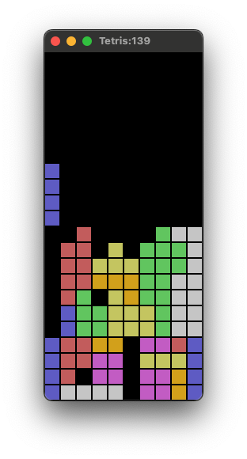

# Rust Tetris

This is a simple implemented of the game Tetris, written in Rust with `winit` and `tiny-skia`.





## How to play

```shell
git clone https://github.com/naotsugu/rust-tetris.git
cd rust-tetris
cargo run
```

* `ArrowRight` `ArrowLeft` - Move left, right
* `ArrowUp` `ArrowDown` - Rotate block
* `Space` - Drop block to bottom of board
* Other Keys - Drop block
* `r` - Retry game


